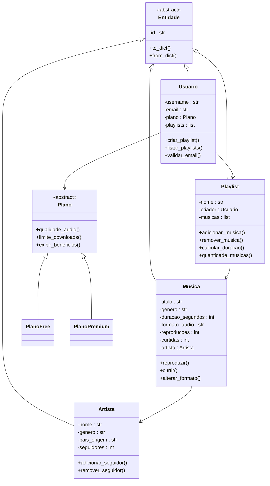

# Sistema de Streaming Musical

Projeto Final da disciplina de Programação Orientada a Objetos.

---

# 1. Introdução

O presente projeto consiste no desenvolvimento de um Sistema de Streaming Musical utilizando Python e os princípios da Programação Orientada a Objetos.

A aplicação foi inspirada em plataformas de streaming amplamente utilizadas atualmente, como Spotify, Deezer, Apple Music e Tidal, permitindo o gerenciamento de artistas, músicas, usuários, planos de assinatura e playlists.

O principal objetivo deste projeto é aplicar os conceitos estudados durante a disciplina, demonstrando a utilização de:

* Classes e Objetos;
* Encapsulamento;
* Herança;
* Polimorfismo;
* Classes Abstratas;
* Composição;
* Persistência de Dados;
* Testes Unitários;
* Organização Modular de Software.

Os dados do sistema são armazenados localmente através de arquivos JSON, simulando um banco de dados simplificado.

---

# 2. Objetivos

O sistema permite:

* Cadastro de artistas;
* Cadastro de músicas;
* Cadastro de usuários;
* Gerenciamento de planos de assinatura;
* Criação de playlists;
* Adição e remoção de músicas em playlists;
* Registro de reproduções;
* Registro de curtidas;
* Geração de relatórios básicos;
* Persistência dos dados em arquivos JSON.

---

# 3. Diagrama UML



---

# 4. Descrição das Classes

## 4.1 Entidade

Classe abstrata utilizada como base para todas as entidades persistidas do sistema.

### Atributos

| Atributo | Tipo |
| -------- | ---- |
| id       | str  |

### Responsabilidades

* Fornecer identificador único.
* Padronizar serialização e desserialização dos objetos.

---

## 4.2 Artista

Representa um artista ou banda cadastrada na plataforma.

### Atributos

| Atributo    | Tipo |
| ----------- | ---- |
| id          | str  |
| nome        | str  |
| genero      | str  |
| pais_origem | str  |
| seguidores  | int  |

### Responsabilidades

* Armazenar informações do artista.
* Gerenciar quantidade de seguidores.
* Servir como referência para músicas cadastradas.

---

## 4.3 Música

Representa uma faixa musical disponível na plataforma.

### Atributos

| Atributo         | Tipo    |
| ---------------- | ------- |
| id               | str     |
| titulo           | str     |
| genero           | str     |
| duracao_segundos | int     |
| formato_audio    | str     |
| reproducoes      | int     |
| curtidas         | int     |
| artista          | Artista |

### Responsabilidades

* Registrar reproduções.
* Registrar curtidas.
* Armazenar informações técnicas da faixa.
* Relacionar a música ao artista responsável.

### Exemplos de formatos de áudio

* MP3 320kbps
* AAC 256kbps
* FLAC 44.1kHz 16-bit
* FLAC 96kHz 24-bit

---

## 4.4 Usuário

Representa um usuário da plataforma.

### Atributos

| Atributo  | Tipo  |
| --------- | ----- |
| id        | str   |
| username  | str   |
| email     | str   |
| plano     | Plano |
| playlists | list  |

### Responsabilidades

* Gerenciar playlists.
* Possuir um plano de assinatura.
* Validar informações de cadastro.

---

## 4.5 Playlist

Representa uma coleção personalizada de músicas criada por um usuário.

### Atributos

| Atributo | Tipo    |
| -------- | ------- |
| id       | str     |
| nome     | str     |
| criador  | Usuario |
| musicas  | list    |

### Responsabilidades

* Adicionar músicas.
* Remover músicas.
* Calcular duração total.
* Informar quantidade de músicas.

---

## 4.6 Plano

Classe abstrata que define o comportamento comum dos planos disponíveis.

### Métodos

* qualidade_audio()
* limite_downloads()
* exibir_beneficios()

---

## 4.7 Plano Free

Representa usuários gratuitos.

### Características

* Reprodução com anúncios.
* Sem downloads offline.
* Qualidade reduzida de áudio.

### Qualidade de áudio

```text
AAC 128kbps
```

---

## 4.8 Plano Premium

Representa usuários assinantes.

### Características

* Sem anúncios.
* Downloads ilimitados.
* Melhor qualidade disponível.

### Qualidade de áudio

```text
FLAC 44.1kHz 16-bit
```

---

# 5. Estrutura do Projeto

```text
Projeto Final POO/
│
├── main.py
│
├── src/
│   ├── __init__.py
│   ├── entidade.py
│   ├── artista.py
│   ├── musica.py
│   ├── usuario.py
│   ├── playlist.py
│   ├── plano.py
│   ├── plano_free.py
│   └── plano_premium.py
│
├── repositories/
│   ├── __init__.py
│   ├── json_manager.py
│   ├── artista_repository.py
│   ├── musica_repository.py
│   ├── usuario_repository.py
│   └── playlist_repository.py
│
├── database/
│   ├── artistas.json
│   ├── musicas.json
│   ├── usuarios.json
│   └── playlists.json
│
├── tests/
│   ├── test_artista.py
│   ├── test_musica.py
│   ├── test_usuario.py
│   ├── test_playlist.py
│   ├── test_plano_free.py
│   ├── test_plano_premium.py
│   └── test_integracao_streaming.py
│
├── requirements.txt
└── README.md
```

---

# 6. Persistência de Dados

A persistência é realizada através de arquivos JSON armazenados na pasta:

```text
database/
```

Arquivos utilizados:

```text
artistas.json
musicas.json
usuarios.json
playlists.json
```

Cada entidade possui um repositório responsável pela leitura e escrita dos dados.

---

# 7. Testes

O projeto utiliza o framework Pytest para validação do comportamento das entidades.

Os testes contemplam:

* Casos de sucesso;
* Validação de regras de negócio;
* Tratamento de estados inválidos;
* Testes de integração entre objetos.

Execução dos testes:

```bash
pytest -v
```

ou

```bash
python -m pytest -v
```

---

# 8. Preparação do Ambiente

## 8.1 Criar Ambiente Virtual

Na pasta raiz do projeto execute:

```bash
python -m venv .venv
```

---

## 8.2 Ativar Ambiente Virtual

### Windows

```bash
.\.venv\Scripts\activate
```

### Linux/macOS

```bash
source .venv/bin/activate
```

---

## 8.3 Instalar Dependências

```bash
pip install -r requirements.txt
```

---

## 8.4 Executar o Sistema

```bash
python main.py
```

---

# 9. Funcionalidades Implementadas

* Cadastro de artistas;
* Consulta de artistas;
* Remoção de artistas;
* Cadastro de músicas;
* Reprodução de músicas;
* Curtida de músicas;
* Cadastro de usuários;
* Gerenciamento de planos;
* Criação de playlists;
* Adição de músicas em playlists;
* Remoção de músicas de playlists;
* Consulta de playlists;
* Relatórios básicos do sistema;
* Persistência local utilizando JSON.

---

# 10. Conceitos de Programação Orientada a Objetos Aplicados

O desenvolvimento deste projeto permitiu aplicar os seguintes conceitos:

* Classes e Objetos;
* Encapsulamento;
* Herança;
* Polimorfismo;
* Classes Abstratas;
* Composição;
* Agregação;
* Persistência de Dados;
* Modularização;
* Testes Unitários.

Esses conceitos são utilizados em conjunto para modelar uma aplicação de streaming musical de forma organizada, reutilizável e extensível.

